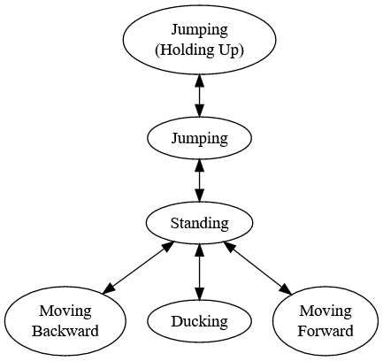
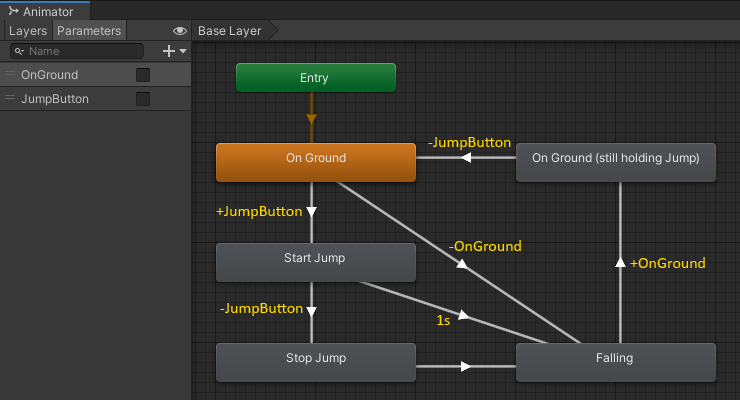

# State Machines
Avoid spaghetti code. Everything is a state machine. Decouple state from logic.

# Problem
An object should change its behavior when its internal state changes. That sounds very abstract, but it's a very common pattern in game code. Let's look at some examples.

1. Input handling: In a fighting game, pressing the *Punch* button should throw a different punch depending on whether the player is moving forward, backward, standing still, jumping, or ducking.
2. AI characters: Bots should react differently when spotting the player depending on their current health, weapons, and number of other bots nearby.
3. Game controller: Whether the ability to quit, pause, or save a game is available should depend on whether the game is loading, saving, paused, running, or quitting,

What's common about these systems is that they tend to be full of special cases. Implementing the logic to handle each special case quickly turns our solution into spaghetti code.

```csharp
if (Input.GetButton("Punch")) {
    if (player.velocity.z > 0) {
        ForwardPunch();
    } else if (player.velocity.z < 0) {
        Grapple();
    } else if (player.isJumping) {
        if (Input.GetAxis("Vertical") > 0) {
            UpwardPunch();
        } else {
            DownwardPunch();
        }
    } else if (player.isDucking) {
        UpwardPunch();
    } else {
        StandingPunch();
    }
}
```

At this point our game designer tells us pressing the *Punch* immediately after standing up after ducking for two seconds should throw a dragon uppercut. Oh and double-tapping *Punch* in air while rising should throw a fireball.

```
(╯°□°）╯︵ ┻━┻
```

# Solution
Special cases are the same as states. Every branch in your code represents a different state. Draw them on a piece of paper and connect them with arrows representing the state changes. Once you get more familiar with the pattern, you will start seeing it everywhere.



The hard part is making sure all the state changes are in the right place and getting triggered correctly, but that's independent from implementing what the *Punch* button is doing in each state. We're decoupling the state handling from the action handling, which allows us to reason about each of them in isolation.

Okay, so now that we know the *shape* of the problem, how do we implement it?

## Animators
The graph above looks a lot like an [animator controller](https://docs.unity3d.com/Manual/Animator.html) in Unity. And, in fact, that's exactly what we are going to use, because it turns out that an animator controller can do so much more than playing animations. Let's walk through an example to see how it works.

# Example
Suppose we are implementing input handling for a Jump 'n' Run platforming game. We want to support [genre staples](https://celestegame.fandom.com/wiki/Moves) like
1. variable jump height that depends on how long the player holds the *Jump* button,
2. [coyote time](https://twitter.com/DavesInHisPants/status/1281189584462917632) which allows the player to jump after running off an edge, and
3. double jump, a second jump while in mid air.

## Jump controller

We start by creating a new animator controller. Our boolean input parameters are whether the *Jump* button is pressed and whether the player is currently on the ground.

Our first state is `On Ground`. That is when the player is able to jump at all. We also need the opposite state, which is `Falling`, and then a few more states which become clearer when we look at the conditions for the state transitions.



Let's look at the `On Ground` state. When the player presses the *Jump* button we start a jump. When the player releases the *Jump* button, we stop the jump by running some game logic to make sure the player character doesn't rise much higher anymore. We then immediately transition to the `Falling` state and we keep falling until the player character touches ground again.

If we transitioned back to `On Ground` straight from `Falling` as soon as the player touches ground, we would end up in a situation where the player would keep bouncing up and down like on a trampoline simply by keeping the *Jump* button pressed, because our state machine would immediately transition back to `Start Jump`. To fix that, we have to add an intermediary state `On Ground (still holding Jump)`.

Wow, jumping is hard. There is a lot of logic in our state machine already and we have only covered the basic variable jump height so far. We can see how this would have been a lot of spaghetti code already.

### Providing parameters
For our jump controller to work, we need to keep its parameter values updated. Luckily Unity makes talking to animator controllers easy.
```csharp
public class JumpControllerParameterProvider : MonoBehaviour
{
    private bool onGround;

    void Update()
    {
        animator.SetBool("OnGround", onGround);
        animator.SetBool("JumpButton", Input.GetButton("Jump"));
    }

    void FixedUpdate()
    {
        onGround = Physics.SphereCast(rigidbody.position, radius, Vector3.down,
                              out RaycastHit hitInfo, distance, groundLayerMask);
    }
}  
```

### Sending messages
In order for our jump controller to do anything, we need it to talk back to our player character scripts. Inheriting from `StateMachineBehaviour` allows us to add our script to any state in a state machine.


To keep things simple, we'll use [Unity's SendMessage](https://docs.unity3d.com/ScriptReference/Component.SendMessage.html) system.

```csharp
public class SendMessageState : StateMachineBehaviour
{
    public string onEnter, onExit;

    public override void OnStateEnter(Animator animator, AnimatorStateInfo stateInfo, int layerIndex)
    {
        if (!string.IsNullOrEmpty(onEnter)) animator.SendMessage(onEnter);
    }

    public override void OnStateExit(Animator animator, AnimatorStateInfo stateInfo, int layerIndex)
    {
        if (!string.IsNullOrEmpty(onExit)) animator.SendMessage(onExit);
    }
}
```

### Handling messages
Finally we need a script to receive the messages sent by the animator controller and apply the appropriate game logic, in this case physics.

```csharp
public class JumpControllerMessageHandler : MonoBehaviour
{
    private bool startJump, stopJump;

    void StartJump() { startJump = true; }
    void StopJump()  { stopJump  = true; }

    void FixedUpdate()
    {
        if (startJump)
        {
            // apply enough force to cancel out any downward momentum
            // the player might have and launch the player into the air.
            var downVelocity = Mathf.Min(rigidbody.velocity.y, 0);
            var deltaVelocity = new Vector3(0, jumpVelocity - downVelocity, 0);
            rigidbody.AddForce(deltaVelocity, ForceMode.VelocityChange);
            startJump = false;
        }
        if (stopJump)
        {
            // apply just enough force to cancel any upward momentum.
            var upVelocity = Mathf.Max(rigidbody.velocity.y, 0);
            var deltaVelocity = new Vector3(0, -upVelocity, 0);
            rigidbody.AddForce(deltaVelocity, ForceMode.VelocityChange);
            stopJump = false;
        }
    }
}
```

## Coyote time
Fortunately, laying the groundworks was the hard part already. Adding [coyote time](https://celestegame.fandom.com/wiki/Moves#Coyote_Time) is simply a matter of adding one more state with a very short timeout of 50 milliseconds. Even though the player character is not technically on ground anymore, we still allow them to perform a jump for a few frames. [Game feel](https://youtu.be/OfSpBoA6TWw?t=833)!


Perhaps most surprisingly, we don't need to touch any code at all. Everything happens still happens in `Start Jump` and `Stop Jump` just like before. It just works.

## Double jump
Double jumping means we give the player a second jump when falling. How does the second jump work? Just like the first jump. So let's copy the relevant states, put them to the right of `Falling`, and connect them up. The *shape* of the problem stays the same.

All we have to do to make it work is making sure that the *Jump* button is not being held before we do the second jump, because otherwise we would have the same trampoline problem we had in the very beginning. And just like before, we solve it by adding an intermediary state `Falling (still holding Jump)`.


In terms of code, again, we don't have to do anything at all. It just works.

Now we can really see the benefit of decoupling the state handling logic from the jump physics implementation. The state machine was the hard part. And that's good, because we use an animator controller to represent our state machine and animator controllers are super easy to debug. Press play and Unity shows you exactly which state is currently active. Compare that to what you see in game and you will spot the bug immediately.

## References

- [Don’t Re-invent Finite State Machines: How to Repurpose Unity’s Animator](https://medium.com/the-unity-developers-handbook/dont-re-invent-finite-state-machines-how-to-repurpose-unity-s-animator-7c6c421e5785) by Darren Tsung
- [Unite 2015 - Applied Mecanim : Character Animation and Combat State Machines](https://www.youtube.com/watch?v=Is9C4i4XyXk) by Aaron Horne
- [Advanced AI in Unity (made easy) - State Machine Behaviors](https://www.youtube.com/watch?v=dYi-i83sq5g) by Noa Calice
- [Game Programming Patterns - State](http://gameprogrammingpatterns.com/state.html) by Bob Nystrom
- [Tips and Tricks for good platforming games](http://www.davetech.co.uk/gamedevplatformer) by David Strachan

# Translations
- [台灣繁體中文 (zh-TW)](README-zh-TW.md)

If you find this workshop useful and speak another language, I'd very much appreciate any help translating the chapters. Clone the repository, add a localized copy of the README.md, for example README-pt-BR.md, and send me a pull request.
